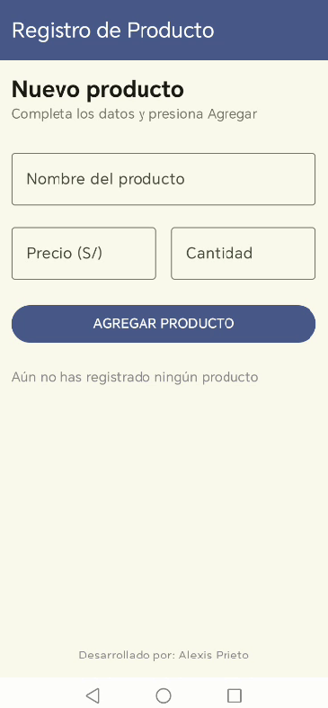
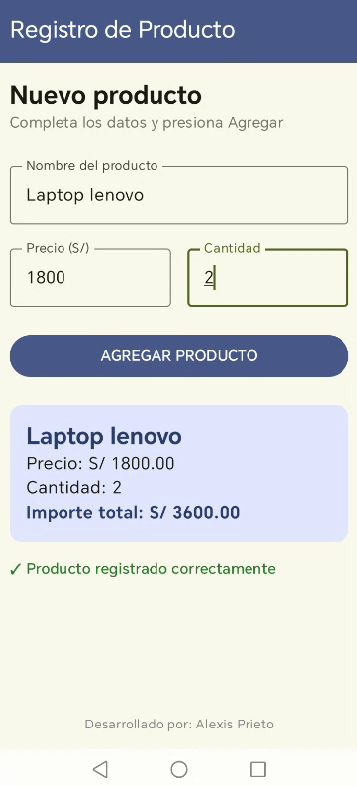
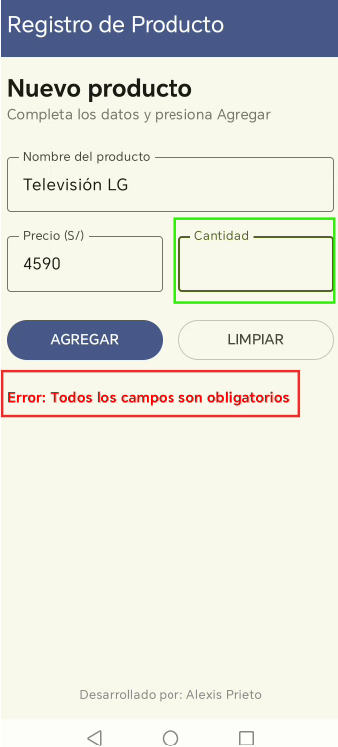
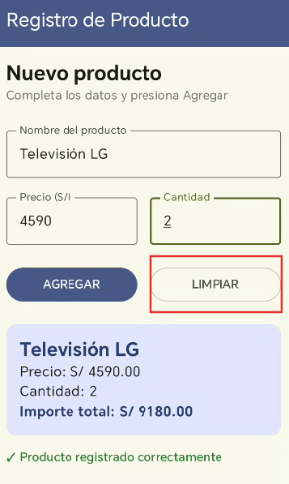
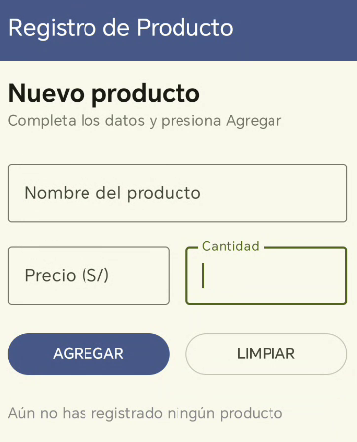

# Lab 03: Registro de Producto
**Alumno:** Prieto Huiza Alexis Stephano
## Descripción
Aplicación móvil desarrollada en android studio utilizando Jetpack Compose en la que permite registrar un producto capturando su nombre, precio y cantidad, calculando automáticamente el importe total dentro de una tarjeta de resumen.

## Capturas de pantalla
Pantalla vacia

Pantalla con producto registrado

## Pregunta de Reflexión
**¿Qué pasaría si declaras las variables de los campos SIN remember?**

Si declaramos las variables de los campos sin remember, su valor se reiniciaría en cada recomposición. Por eso, lo que el usuario haya escrito podría perderse y volver al valor inicial.

## Mejora con IA

| Prompt que usé                                                                                                                                                                             | Qué generó Gemini                                                                                                                                                            | Qué acepté o corregí (y por qué)                                                                                                                                                                                                          |
|:-------------------------------------------------------------------------------------------------------------------------------------------------------------------------------------------|:-----------------------------------------------------------------------------------------------------------------------------------------------------------------------------|:------------------------------------------------------------------------------------------------------------------------------------------------------------------------------------------------------------------------------------------|
| "De mi código actual, agrega validación de campos vacíos e inválidos al presionar AGREGAR mostrando un mensaje en rojo, y un botón Limpiar para vaciar el formulario en PantallaRegistro." | Generó las variables de estado "mensajeError", las comprobaciones "isBlank()" / "toDoubleOrNull()" , la alerta de error en rojo y la fila con los botones AGREGAR y LIMPIAR. | Acepté la estructura lógica de validaciones y el botón de limpiado, pero corregí el mensaje de error para hacerlo más explícito y mantuve el texto "AGREGAR" en el botón ya que el texto se rompia visualmente en dos líneas y evité eso. |

**Evidencia del mensaje de error**

**Evidencia de que el producto se borra al presionar el boton "limpiar"**

